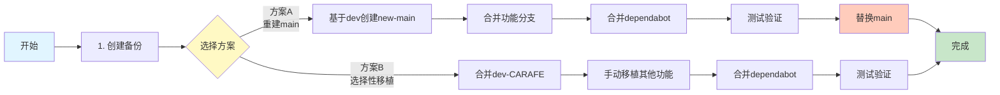
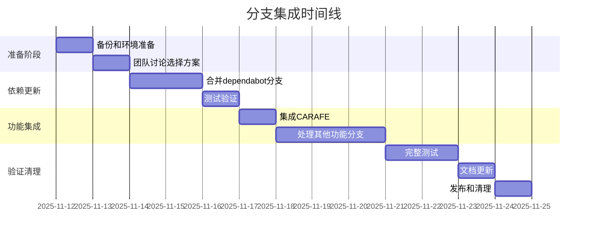

# 分支关系可视化图

## 分支结构图

```mermaid
graph TD
    A[main 分支<br/>1个提交<br/>f480af5] 
    
    B[dev 分支<br/>2867个提交<br/>领先main 2867]
    C[dev-CARAFE 分支<br/>1个领先提交<br/>可直接合并]
    D[dev-CBAM 分支<br/>2861个提交<br/>领先main 2861]
    E[SIoU 分支<br/>2858个提交<br/>领先main 2858]
    F[test-custom-yaml 分支<br/>2849个提交<br/>领先main 2849]
    
    G[dependabot/actions/checkout-5<br/>2个领先提交]
    H[dependabot/actions/download-artifact-5<br/>2个领先提交]
    I[dependabot/actions/setup-python-6<br/>2个领先提交]
    J[dependabot/actions/stale-10<br/>2个领先提交]
    K[dependabot/astral-sh/setup-uv-7<br/>2个领先提交]
    L[dependabot/pip/onnx<br/>2个领先提交]
    
    A -.->|无共同历史| B
    A -.->|无共同历史| D
    A -.->|无共同历史| E
    A -.->|无共同历史| F
    A -->|可合并| C
    A -->|可合并| G
    A -->|可合并| H
    A -->|可合并| I
    A -->|可合并| J
    A -->|可合并| K
    A -->|可合并| L
    
    style A fill:#ff9999
    style C fill:#99ff99
    style G fill:#99ff99
    style H fill:#99ff99
    style I fill:#99ff99
    style J fill:#99ff99
    style K fill:#99ff99
    style L fill:#99ff99
    style B fill:#ffff99
    style D fill:#ffff99
    style E fill:#ffff99
    style F fill:#ffff99
```



## 图例说明

- 🔴 **红色 (main)**: 当前主分支，历史较短
- 🟢 **绿色**: 可以直接合并的分支（低风险）
- 🟡 **黄色**: 需要特殊处理的分支（与main无共同历史）
- **实线箭头**: 可以直接合并
- **虚线箭头**: 无共同历史，需要特殊处理

## 分支分类一览表

| 分支名称 | 类型 | 领先提交 | 落后提交 | 风险级别 | 推荐操作 |
|---------|------|---------|---------|---------|---------|
| **功能开发分支** | | | | | |
| dev | 主开发分支 | 2867 | 1 | 高 | 考虑作为新main基础 |
| dev-CARAFE | CARAFE模块 | 1 | 0 | 低 | 直接合并 |
| dev-CBAM | CBAM注意力 | 2861 | 1 | 高 | 需要特殊处理 |
| SIoU | SIoU损失函数 | 2858 | 1 | 高 | 需要特殊处理 |
| test-custom-yaml | 测试分支 | 2849 | 1 | 中 | 评估后决定 |
| **依赖更新分支** | | | | | |
| dependabot/checkout-5 | GH Actions | 2 | 0 | 低 | 优先合并 |
| dependabot/download-artifact-5 | GH Actions | 2 | 0 | 低 | 优先合并 |
| dependabot/setup-python-6 | GH Actions | 2 | 0 | 低 | 优先合并 |
| dependabot/stale-10 | GH Actions | 2 | 0 | 低 | 优先合并 |
| dependabot/setup-uv-7 | GH Actions | 2 | 0 | 低 | 优先合并 |
| dependabot/onnx | Python包 | 2 | 0 | 低 | 优先合并 |

## 集成顺序流程图



## 主要冲突预测

### dev-CARAFE 分支变更
```
新增文件:
  - CARAFE_demo.py (CARAFE演示脚本)
  - carafe_i.py (CARAFE实现)
  - ultralytics/cfg/models/11/yolo11s_CARAFE.yaml (配置文件)

修改文件:
  - ultralytics/nn/modules/__init__.py
  - ultralytics/nn/modules/block.py
  - ultralytics/nn/tasks.py
  - ultralytics/models/yolo/detect/train.py
```

### Dependabot 分支变更
```
主要变更:
  - GitHub Actions 工作流文件
  - Python包版本 (pyproject.toml)
  - 代码格式化更新
```

## 时间线规划



## 关键决策点

### 决策1: 选择集成方案
- **时间点**: 分析完成后立即
- **参与者**: 项目负责人、核心开发者
- **输入**: 本分析报告
- **输出**: 选定的集成方案

### 决策2: 是否保留test-custom-yaml
- **时间点**: 功能分支集成时
- **参与者**: 开发者
- **考虑因素**: 实验结果、功能价值

### 决策3: 是否删除已合并分支
- **时间点**: 集成完成后
- **参与者**: 项目维护者
- **考虑因素**: 团队工作流程、分支管理策略

## 常见问题解答

### Q1: 为什么有些分支显示"无变更"但有很多提交？
**A**: 这些分支与main分支没有共同的历史基础（no merge base）。它们是从完整的ultralytics项目历史开发的，而main分支是一个较新的、历史被简化的分支。

### Q2: 最安全的集成方式是什么？
**A**: 创建备份分支，然后在临时分支上测试集成，验证无误后再推送到main。

### Q3: 可以跳过某些dependabot更新吗？
**A**: 技术上可以，但不推荐。这些更新通常包含安全修复和性能改进。

### Q4: 集成会影响现有功能吗？
**A**: 如果按照推荐的方案和测试流程，风险可控。关键是每次集成后都要运行完整测试。

### Q5: 需要多少人参与这个集成工作？
**A**: 建议至少2人：1人执行集成操作，1人进行代码审查和测试验证。

---

**可视化更新时间**: 2025-11-12 03:18:39  
**工具**: Mermaid Diagram + Markdown
